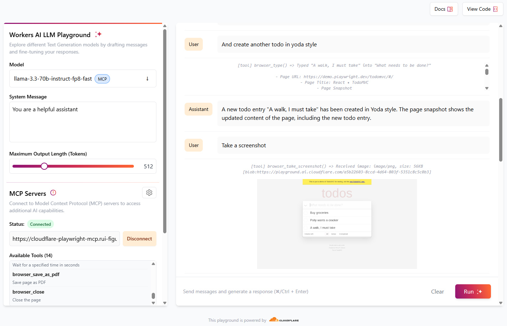
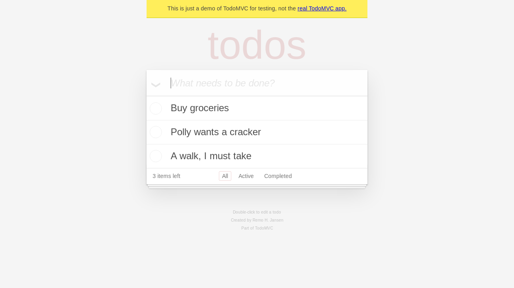
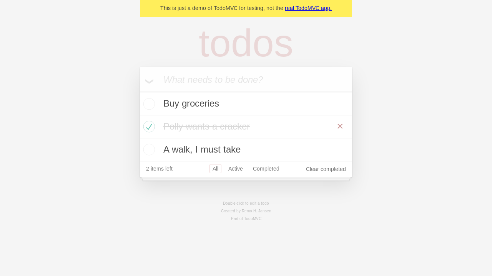
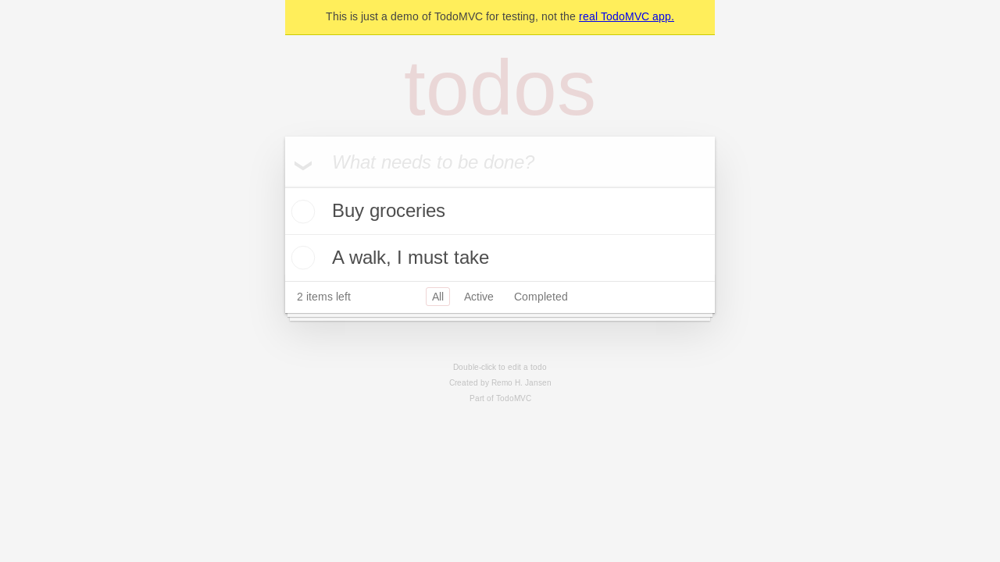
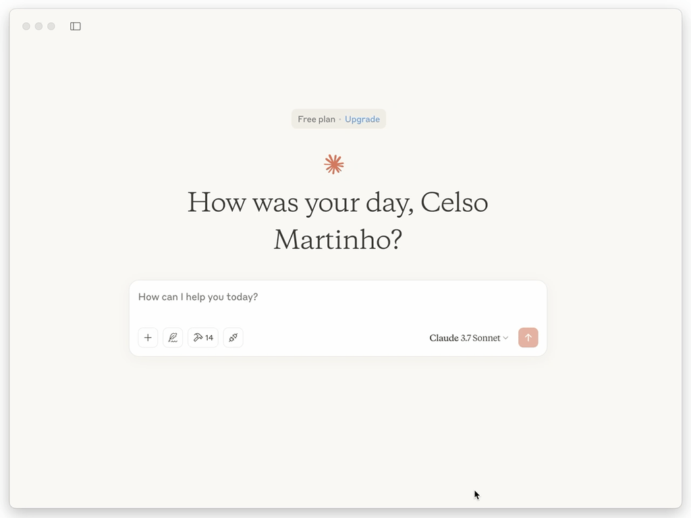

## Cloudflare Playwright MCP Example

[](https://deploy.workers.cloudflare.com/?url=https://github.com/cloudflare/puppeteer/tree/main/examples/playwright-mcp-cloudflare)

### Overview

This project demonstrates how to use [Playwright with Cloudflare Workers](https://github.com/cloudflare/playwright) as a Model Control Protocol (MCP) server using [Cloudflare Playwright MCP](https://github.com/cloudflare/playwright-mcp).

It enables AI assistants to control a browser through a set of tools, allowing them to perform web automation tasks like navigation, typing, clicking, and taking screenshots.

The server can be used with various AI platforms including Cloudflare AI Playground, Claude Desktop, and GitHub Copilot in VS Code.

### Deploy

Follow these steps to set up and deploy the project:

1. Install dependencies:
```bash
npm ci
```

2. Deploy to Cloudflare Workers:

```bash
npx wrangler deploy
```

### Use with Cloudflare AI Playground



[Cloudflare playground AI](https://playground.ai.cloudflare.com/) is a great way to test MCP servers using LLM models available in Workers AI.

- Navigate to https://playground.ai.cloudflare.com/
- Ensure model is set to `llama-3.3-70b-instruct-fp8-fast`
- In **MCP Servers**, set **URL** to `https://[my-mcp-url].workers.dev/sse`
- Click **Connect**
- Status should update to **Connected** and it should list 14 available tools

You can now start to interact with the model, and it will run necessary tools to accomplish what was requested.

> [!TIP]
> For best results, give simple instructions consisting of one single action, e. g., "Create a new todo entry", "Go to cloudflare site", "Take a screenshot"

Example of a conversation:

| Role | Message |
|------|---------|
| **User** | Go to demo.playwright.dev/todomvc |
| **Assistant** | *runs browser_navigate tool*<br> The page has been navigated to https://demo.playwright.dev/todomvc/. The page title is "React • TodoMVC". The page snapshot shows the content of the page, including a heading, a textbox, and several links. |
| **User** | Create some todo entry |
| **Assistant** |  *runs browser_type tool*<br> A new todo entry "Buy groceries" has been created. The page snapshot shows the updated content of the page, including the new todo entry. |
| **User** | Nice. Now create a todo in parrot style |
| **Assistant** | *runs browser_type tool*<br> A new todo entry "Polly wants a cracker" has been created in parrot style. The page snapshot shows the updated content of the page, including the new todo entry. |
| **User** | And create another todo in yoda style |
| **Assistant** | *runs browser_type tool*<br> A new todo entry "A walk, I must take" has been created in Yoda style. The page snapshot shows the updated content of the page, including the new todo entry. |
| **User** | Take a screenshot |
| **Assistant** | *runs browser_take_screenshot tool*<br>  A screenshot of the current page has been taken. The screenshot is in PNG format and is 56KB in size. |
| **User** | Now click the checkbox of the parrot todo entry |
| **Assistant** | *runs browser_clickt tool*<br> The checkbox of the parrot todo entry "Polly wants a cracker" has been clicked. The page snapshot shows the updated content of the page, with the checkbox now checked. |
| **User** | Take a screenshot |
| **Assistant** | *runs browser_take_screenshot tool*<br>  A screenshot of the current page has been taken. The screenshot is in PNG format and is 58KB in size. |
| **User** | Remove completed todo entries |
| **Assistant** | *runs browser_clickt tool*<br> The "Clear completed" button has been clicked. The page snapshot shows the updated content of the page, with the completed todo entry "Polly wants a cracker" removed. |
| **User** | Take a final screenshot |
| **Assistant** | *runs browser_take_screenshot tool*<br>  A final screenshot of the current page has been taken. The screenshot is in PNG format and is 50KB in size. |

### Use with Claude Desktop

As of now, [Claude Desktop](https://claude.ai/download) only supports local MCP servers. To use `playground-mcp` with Claude Desktop we make use of [mcp-remote](https://github.com/geelen/mcp-remote), a tool that proxies remote MCP servers and exposes them locally. Use the following configuration:

1. Open the configuration file for Claude Desktop.
2. Add the following JSON snippet under the `mcpServers` section:

```json
{
  "mcpServers": {
    "cloudflare-playwright-mcp": {
      "command": "npx",
      "args": [
        "mcp-remote",
        "https://[my-mcp-url].workers.dev/sse"
      ]
    }
  }
}
```

3. Save the configuration file and **restart** Claude Desktop to apply the changes.

This setup ensures that Claude Desktop can communicate with the Cloudflare Playwright MCP server.

Here's an example of a session opening the TODO demo app, adding "buy lemons" and doing a screenshot, taking advantage of playwright-mcp tools and Browser Rendering:



### Configure in VSCode

You can install the Playwright MCP server using the [VS Code CLI](https://code.visualstudio.com/docs/configure/command-line):

```bash
# For VS Code
code --add-mcp '{"name":"cloudflare-playwright","type":"sse","url":"https://[my-mcp-url].workers.dev/sse"}'
```

```bash
# For VS Code Insiders
code-insiders --add-mcp '{"name":"cloudflare-playwright","type":"sse","url":"https://[my-mcp-url].workers.dev/sse"}'
```

After installation, the Playwright MCP server will be available for use with your GitHub Copilot agent in VS Code.
